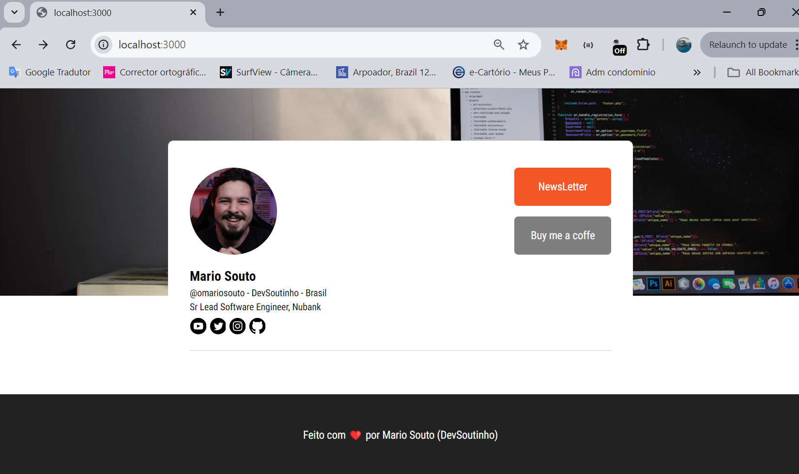

# NextJs-FullStack

- Este projeto é fruto do curso de 'Next.js Full stack: arquitetura de componentes Front-end' da plataforma ALURA

## Introdução

 - Esse projeto faz parte de dois cursos ministrados por instrutor **Mario Souto** onde essa é a primeira parte do curso que abordam boas práticas de componentização. Aqui foi focada em criar componentes fundamentais para o projeto, e como esses componentes podem ser customizados.

## Apresentação do projeto

 - Nesse projeto foi mostrado como traduzir um layout do Figma em componentes no Next.js


 https://www.figma.com/design/g3ZMmAOdQ1E4nsX1eVoIkT/WebSite---Timeline?node-id=0-1&node-type=canvas&t=AnbhT4GNA8fpq4N9-0


- Tambem foram vistos os benefícios de criar uma boa base de componentes para suas aplicações em Next.js

- Entender como estruturar os componentes de seu projeto e separar o visual feito pela equipe de design do código

- Foi implementada uma aplicação do zero no Next.js utilizando o Typescript e styled-components
Descubra como criar componentes base e técnicas de código que melhoram o autocomplete do seu código Typescript

 


 ## Instalação do Projeto

### 1. Clonar o Repositório

Primeiramente, faça o download do código fonte deste repositório no GitHub utilizando o comando:

```bash
git clone https://github.com/msbzz/nextjs-fullstack.git
```

### 2. Instalar as Dependências

Navegue até a pasta do projeto e instale todas as dependências necessárias utilizando o **npm** (que é instalado junto com o Node.js):

```bash
cd nextjs-fullstack
npm install
```


## Aplicativos de Interface de Usuário (IU)

Neste projeto utilizei o **vscode** mas é compatível com qualquer editor de código

- **Visual Studio Code**: Um editor leve e poderoso para desenvolvimento de aplicações web. Você pode baixá-lo [aqui](https://code.visualstudio.com/).


### Executando o Projeto

Com todas as dependências instaladas e as variáveis de ambiente configuradas, você pode iniciar o servidor de desenvolvimento do Next.js com o comando:

```bash
npm run dev
```

O projeto estará acessível em `http://localhost:3000` e, com o Ngrok ativado, também estará acessível por meio de um domínio público gerado automaticamente.


 ### Tópicos abordados no curso


- A importância de conhecer conceitos importantes de design system utilizadas por várias empresas;
- Que o design da aplicação é um contrato e que tá muito relacionado ao que a pessoa desenvolvedora irá desenvolver no código;
- Que existem alguns componentes que são a base para qualquer design front end;
- Como iniciar um projeto do zero com o Next JS e o Typescript;
- A criar o componente Box, que é um dos componentes bases de uma aplicação Front end;
- A utilizar absolute imports para simplificar os caminhos de importação de alguns arquivos de sua aplicação;
- A instalar o styled-components e a configurar o Next JS para lidar melhor com essa lib;
- A utilizar a lib skynexui para lidar com breakpoints na aplicação;
- Como criar um componente base para receber e repassar props.

- Como descrever componentes do Figma com código na sua aplicação, como o Text, o Feed, e o Background;
- Como adicionar estilos globais na aplicação com o GlobalStyle;
- Refatorar os componentes de Box, Tex, BaseComponent e de Stylesheet;
- Adicionar o componente Footer da aplicação;
- Adicionar fontes externas na aplicação utilizando o Google fonts e o componente Head do próprio Next JS;
- Como adicionar e configurar um padrão de uso para a tipografia do projeto;
- Como desacoplar o tema da aplicação, configurando um provedor de tema;
- Como melhorar a técnica de autocomplete da aplicação.

- Como criar um componente Icon para adicionar arquivos de ícones na aplicação;
- Como exportar por padrão um icone svg;
- Como criar um componente de imagem com alt obrigatório;
- Como configurar as cores de sua interface e utilizar o tema para prover essas cores no projeto

- Como criar um componente de Link para links externos e externos;
- Como utilizar o NextLink no componente Link criado;
- Como criar um componente Botão que serve como base para todos os botões que venham a existir na aplicação;
- Como utilizar a biblioteca react-use-ripple para criar um efeito no botão ao ser clicado;
- Como criar estilos para o botão utilizando a função colorVariant() que recebe o tema com as cores e retorna um objeto com as cores do Botão;
- Como adicionar tamanhos para o Botão em diferentes telas.

- Como montar o layout da aplicação com todos os componentes criados nas aulas passadas;
- Aprendeu como estruturar o layout e estilizar conforme o Figma do projeto;
- Posicionar os elementos na tela.

### Funcionalidades estudadas no projeto


- Como traduzir um layout do Figma em componentes no Next.js
- Conheçer os benefícios de criar uma boa base de componentes para suas aplicações em Next.js
- Entender como estruturar os componentes de seu projeto e separar o visual feito pela equipe de design do código
- Implementar uma aplicação do zero no Next.js utilizando o Typescript e styled-components
- Descobrir como criar componentes base e técnicas de código que melhoram o autocomplete do seu código Typescript
